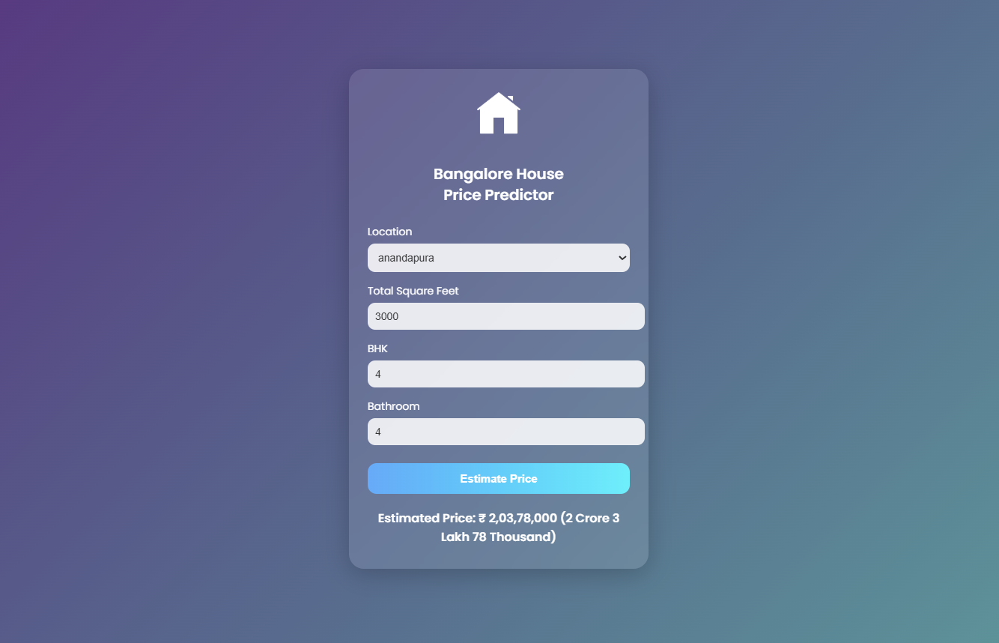

<h1 align="center">🏠 Bangalore House Price Predictor</h1>

💡 Predict house prices in ₹ Crore | Lakh | Thousand using ML-powered Flask App 🧠

---

## 📸 Project Preview

---

## 🚀 Features

- 🔮 Real-time house price prediction
- 📍 Dynamic location loading from backend
- 🧠 Trained ML model with Linear Regression
- 🎨 Stylish & animated frontend (HTML/CSS/JS)
- 🇮🇳 Smart INR formatting: ₹ 2 Crore 8 Lakh 50 Thousand

---

## 🛠️ Tech Stack

| Layer     | Tools Used                       |
|-----------|----------------------------------|
| Frontend  | HTML, CSS, JavaScript            |
| Backend   | Flask (Python)                   |
| ML Model  | Scikit-Learn (Linear Regression) |
| Dataset   | Bangalore Housing Prices dataset |

---

## 💻 How to Run This Project Locally

### 🔹 Step 1: Clone the Repository

git clone https://github.com/AbhiRathour7/House-Price-Pridiction.git  
cd House-Price-Pridiction

### 🔹 Step 2: Backend Setup (Flask)

cd server  
pip install -r requirements.txt  
python server.py  
Backend runs at http://127.0.0.1:5000

### 🔹 Step 3: Frontend Launch

Simply open:

client/app.html  
It auto connects with the backend Flask server 🎯

📁 Project Folder Structure

House-Price-Pridiction/
├── client/
│   ├── app.html
│   ├── app.css
│   └── app.js
├── server/
│   ├── server.py
│   ├── util.py
│   └── artifacts/
│       ├── banglore_home_prices_model.pickle
│       └── columns.json

🧠 Sample Predictions

| Location        | Sqft | BHK | Bath | Estimated Price       |
| --------------- | ---- | --- | ---- | --------------------- |
| Whitefield      | 1800 | 3   | 2    | ₹ 2 Crore 8 Lakh      |
| Electronic City | 1200 | 2   | 2    | ₹ 84 Lakh 50 Thousand |
